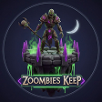

# ZOOMBIE KEEP

**Zoombie Keep** is a 3D tower defense-style web game built with React, Three.js, and Rapier Physics. Protect the town center graveyard from an endless horde of vampires!



## 🎮 Gameplay

- **Objective:** Defend the base from incoming vampires. If too many reach the base, its integrity will drop. If it reaches 0, the game is over.
- **Controls:**
  - **Shoot/Deploy:** `Spacebar` or `Mouse Click`
  - **Steer/Move:** `Mouse Movement` or `Click & Drag`
- **Mechanics:** Guide your deployed ghosts through the glowing **Green Multiplier Zones** to increase your swarm size and overpower the enemies!

## 🛠️ Technology Stack

- **Framework:** React / [TanStack Start](https://tanstack.com/start)
- **3D Rendering:** [@react-three/fiber](https://docs.pmnd.rs/react-three-fiber/getting-started/introduction) & [@react-three/drei](https://github.com/pmndrs/drei)
- **Physics Engine:** [@react-three/rapier](https://github.com/pmndrs/react-three-rapier)
- **State Management:** [Zustand](https://zustand-demo.pmnd.rs/) (including LocalStorage persistence for High Scores)
- **Styling:** [Tailwind CSS](https://tailwindcss.com/)
- **UI Animations:** [Framer Motion](https://www.framer.com/motion/)
- **Icons:** [Lucide React](https://lucide.dev/)

## 🚀 Getting Started

### Prerequisites

Make sure you have Node.js installed. We recommend using `pnpm` as the package manager.

### Installation & Running Locally

1. Install dependencies:

   ```bash
   pnpm install
   ```

2. Start the development server:

   ```bash
   pnpm dev
   ```

3. Open your browser and navigate to the local server address (usually `http://localhost:3000`).

### Building for Production

To create an optimized production build:

```bash
pnpm build
```

## 📂 Project Structure

- `src/components/game/` - 3D game entities and scenes (`GameScene.tsx`, `Enemy.tsx`, `Ally.tsx`, `Base.tsx`, `Environment.tsx`).
- `src/components/ui/` - 2D DOM overlays and UI interfaces (`MainMenu.tsx`, `HUD.tsx`, `GameOverOverlay.tsx`).
- `src/store/` - Zustand global game state (`gameStore.ts`).
- `src/routes/` - Application routing (`index.tsx`).

---

_Defend the town from the eternal sleep._

**Credits:**

- Assets from **Keenly**
- Sound from **Zapsplat**
